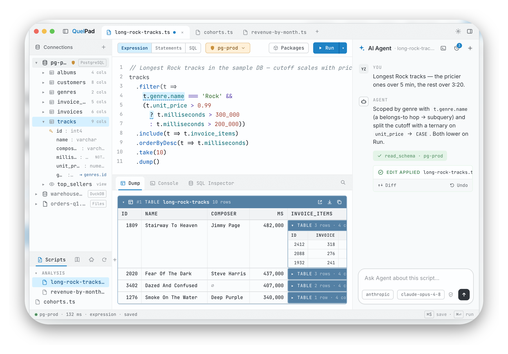

# QuelPad

**The TypeScript scratchpad. Databases built in.**

QuelPad is a desktop scratchpad for TypeScript developers: query a real
database with a typed Fluent API or raw SQL, transform the rows in plain
TypeScript, and see every result rendered — sortable tables, charts, pivots,
trees, diffs — right under the editor. Everything runs locally; credentials
live in your OS keychain; the built-in AI agent drafts scripts but has no
tool to run anything — the Run button stays yours.

- **Website** — [quelpad.com](https://quelpad.com)
- **Documentation** — [docs.quelpad.com](https://docs.quelpad.com)
- **Download (Public Beta)**
  - macOS (Apple Silicon, signed & notarized): [QuelPad-aarch64.dmg](https://updates.quelpad.dev/download/QuelPad-aarch64.dmg)
  - Windows (x64, beta installer): [QuelPad-x64-setup.exe](https://updates.quelpad.dev/download/QuelPad-x64-setup.exe) — not code-signed yet, so SmartScreen shows a one-time warning: **More info → Run anyway**. See [Installation](https://docs.quelpad.com/getting-started/installation/).

Works with PostgreSQL, MySQL / MariaDB, SQLite, and SQL Server over native
protocols, plus serverless engines (Neon, PlanetScale, CockroachDB,
ClickHouse, TiDB Cloud, SingleStore, …) and local files — drag in a `.csv`,
`.parquet`, `.sqlite`, or `.duckdb` and it connects as a typed database.

Using Claude Code or Cursor? QuelPad plugs into your agent directly — one
click opens your workspace in a terminal with the `quelpad` CLI and an
`AGENTS.md` set up, and `quelpad open` hands finished scripts back to the
app. See [Claude Code & external agents](https://docs.quelpad.com/ai/external-agents/).

## About this repository

QuelPad is a commercial, closed-source product built by an independent
developer ([why it isn't open source](https://docs.quelpad.com/reference/faq/#why-not-just-open-source-it)).
This repository is its public home for **issues and feedback** — there is no
application source code here.

**File an issue for:**

- 🐛 **Bugs** — crashes, wrong results, UI problems. Please attach the crash
  dump or console output ([where to find diagnostics](https://docs.quelpad.com/reference/troubleshooting/#where-to-find-diagnostics)).
- 📚 **Documentation problems** — typos, wrong statements, missing pages on
  [docs.quelpad.com](https://docs.quelpad.com).
- 💡 **Feature requests** — what you're missing and what you'd use it for.

**Email instead for:**

- Pre-purchase questions and license issues — `support@quelpad.com`
- Security disclosures — `security@quelpad.com` (see [SECURITY.md](SECURITY.md)); please do **not** open a public issue.
